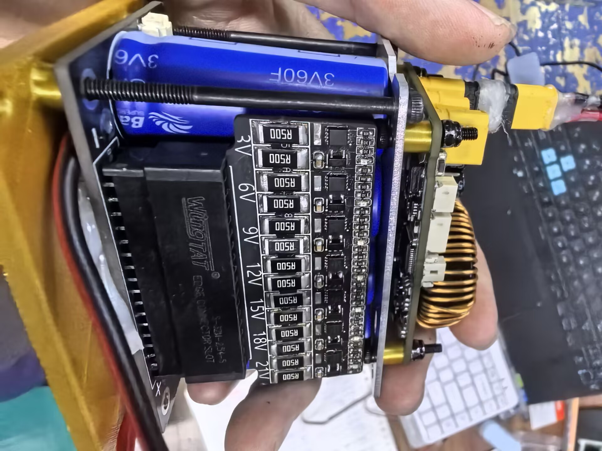
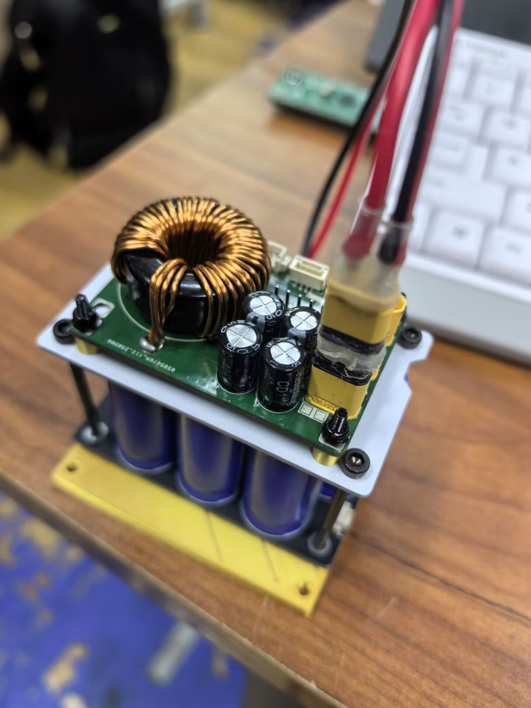

# RM_SUPERCAP_JSU
复刻RM桂林理工大学的开源  
我们学校一直没有超电,或许我能填补这个空缺  

**10.8**  
已经做出来了,上车测试功能完好,能充电能放电,暂时没有遇到问题  
**10.19**  

  
# SUPERCAP 超级电容控制器

基于 STM32G431 的 RoboMaster 超级电容功率控制系统

---

## 项目简介

SUPERCAP 是专为 RoboMaster 机器人设计的超级电容功率控制器。通过双向 BUCK-BOOST 电路实现超级电容的充放电管理，配合 CAN 总线通信与主控板协同工作，提升机器人瞬时功率输出能力。

---

## 工作原理

### 系统架构

控制器通过 CAN 总线接收 RM 主控板发送的以下指令：
- 系统使能信号
- 充电/放电模式切换
- 底盘功率上限
- 充电功率设定

### 充电模式

使用 BUCK-BOOST 电路对超级电容充电，实时检测充电电流和功率，通过 PID 算法控制 NMOS 栅极 PWM，精确调节充电电压。

### 放电模式

使用 BUCK-BOOST 电路向底盘供电，实时检测放电电流和电压，动态调整占空比以控制放电功率，满足功率限制要求。

---

## 硬件设计

### 核心器件

| 功能 | 型号 | 规格 |
|-----|------|------|
| 主控芯片 | STM32G431CBT6 | ARM Cortex-M4, 170MHz |
| 栅极驱动 | EG2181 | 高速半桥驱动器 |
| 半桥 MOS | WSD40120DN56G | 40V/120A |
| 关断 PMOS | WSD40L60DN56 | 40V/60A |
| 储能电感 | 106-125 磁环 | 22µH |
| 母线电流采样 | INA139 | 高侧电流检测 |
| 电容电流采样 | INA181A2 | 双向电流检测 |
| 辅助电源 | JW5026 + RT9193 | DC-DC + LDO |

### 设计工具

本项目使用 **KiCad 8.0** 进行硬件设计。

---

  

---
> **本项目主要面向HR。**  
