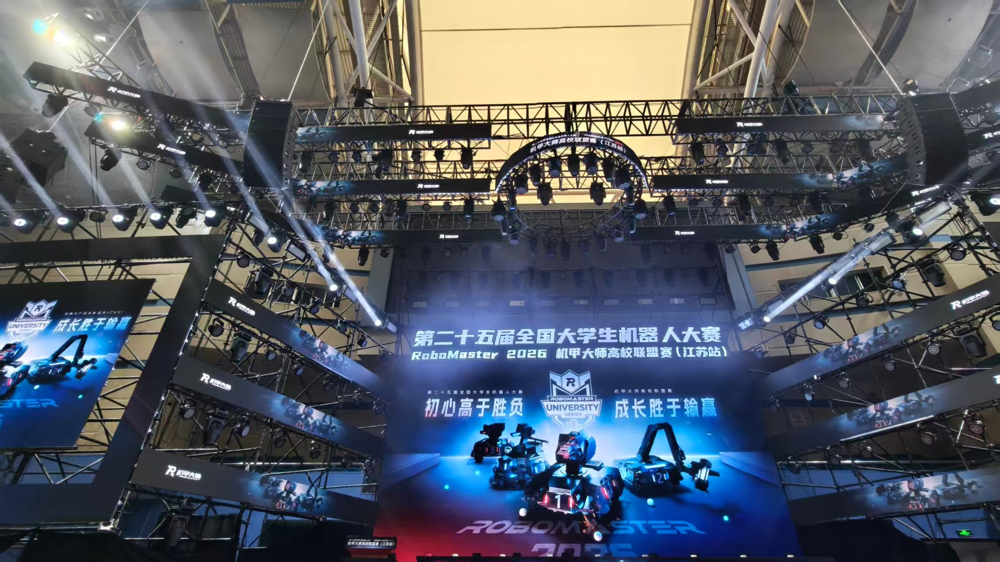
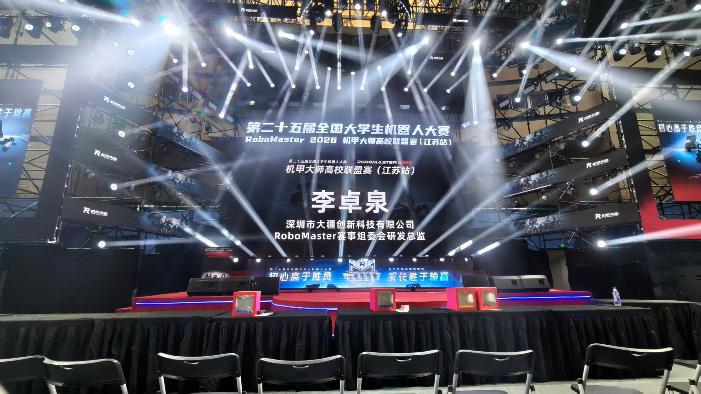
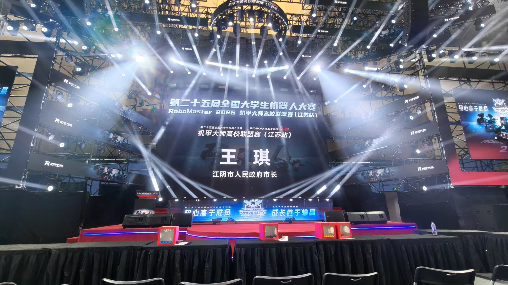

# RM 超级电容控制器

本仓库整合了我的两个 RoboMaster 超级电容控制器项目。

| 项目               | 来源             | 主控      | 目录                                      |
| ------------------ | ---------------- | --------- | ----------------------------------------- |
| RM_SUPERCAP_JSU    | 复刻桂林理工大学 | STM32G431 | [`gui_lin_li_gong/`](./gui_lin_li_gong/)   |
| RM_SUPERCAP_JSU_V2 | 复刻香港科技大学 | STM32F334 | [`xiang_gang_ke_ji/`](./xiang_gang_ke_ji/) |

---

## 一、RM_SUPERCAP_JSU（复刻桂林理工大学）

复刻 RM 桂林理工大学的开源
我们学校一直没有超电，或许我能填补这个空缺

**10.8**
已经做出来了，上车测试功能完好，能充电能放电，暂时没有遇到问题

**10.19**

---

## 二、RM_SUPERCAP_JSU_V2（复刻香港科技大学）

复刻香港科技大学

**11.1**
现在的问题是电容端口短路，初步怀疑是原件选型错误，解决方法：加上了群里的同学一起讨论，和队里的研究生一起排查，看研究生的学习笔记，学习 C++

**11.13**
GAME WILL OVER，lucky，终于冲放电成功了，不报错，不过另一个的上板电流采样芯片可能坏了，等快递

**11.15**
研究生学姐走了，剩下的成果归本人所有

**11.18**
第二个也做出来了，一开始错误的原因是底盘电流检测芯片选型错误，要 INA240PW1 才是对的，INA240PW2 的增益是不同的
这如此种种也不过如此啊

**11.19**
炸了....

**11.20**
上车正常，最终效果：可以成功存储能量，要用的时候再输出，根据功率自动选择存储还是释放，功率闭环 + 缓冲能量闭环

## 2026/4/28

我准备拿香港科技大学的硬件基础,重新写一遍程序,因为他里面有些地方有问题,很多人都是看不懂他们的代码,他们拿C++写的,就是为了炫技,同学们看不懂代码确实不好调,我拿C语言重新写一遍,不过这个项目要在打完所有比赛再开始,也算是我人生中为大学里的竞赛留下最后一点痕迹
