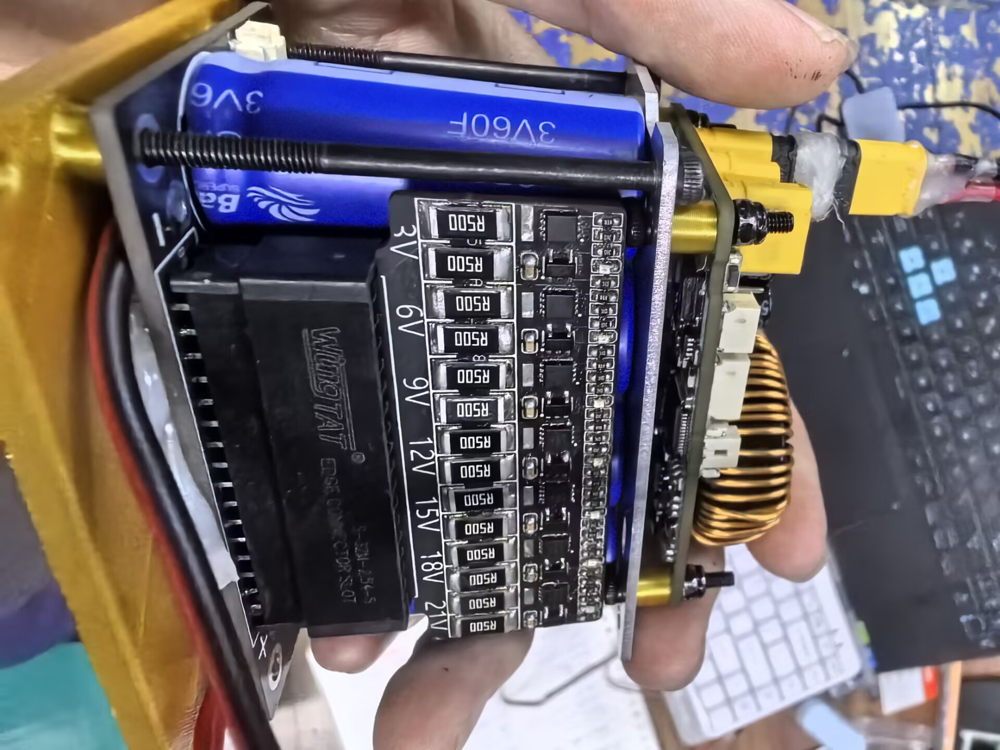
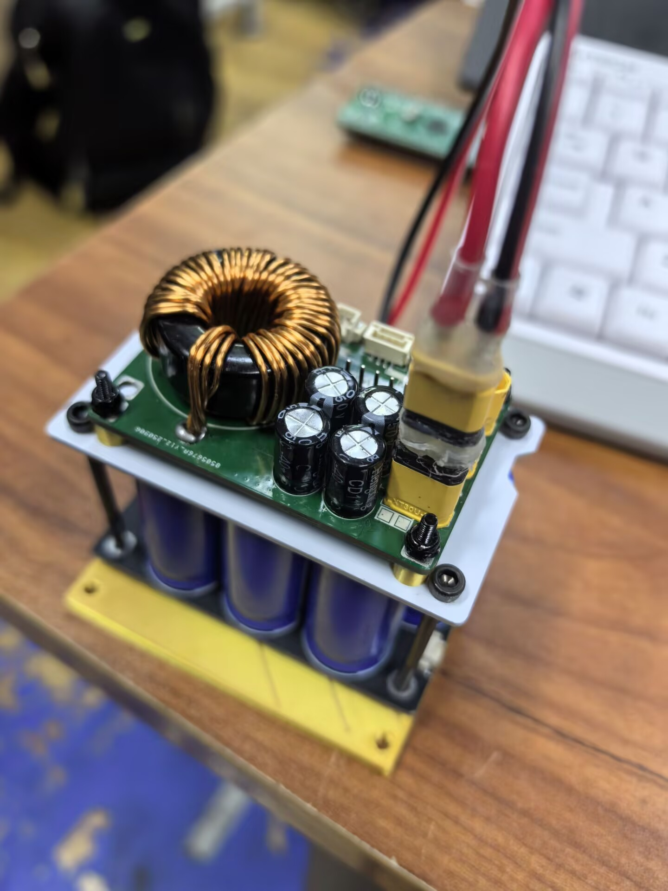
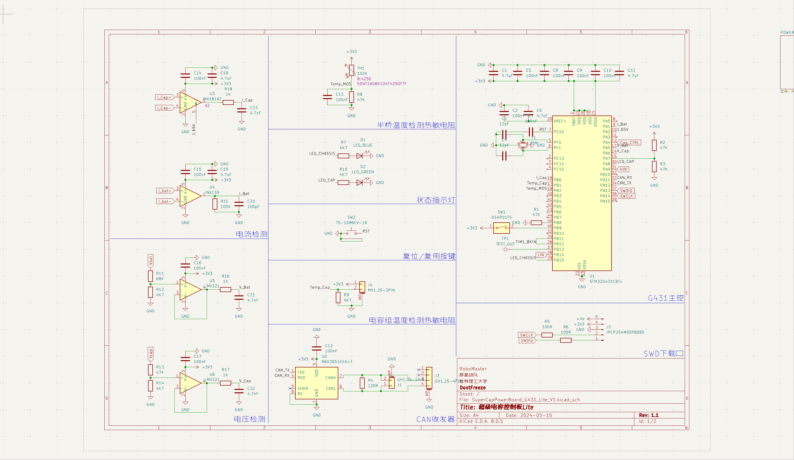
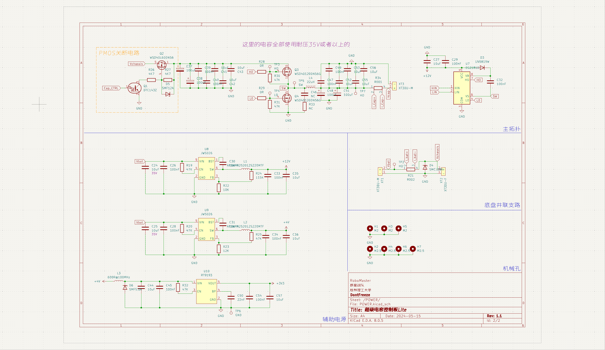
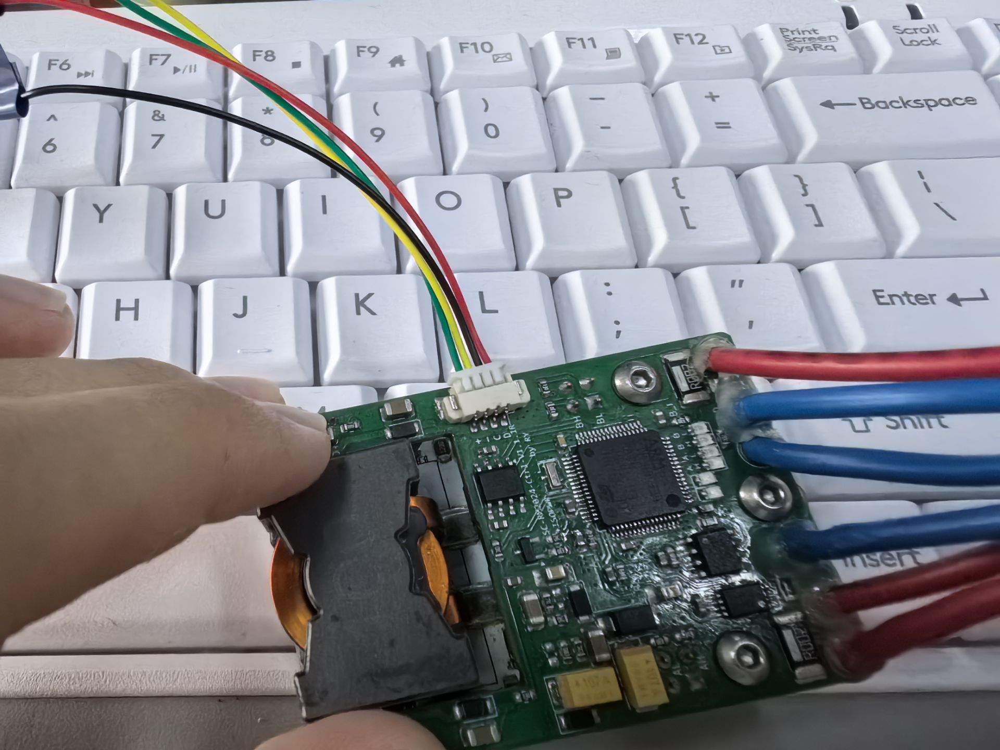
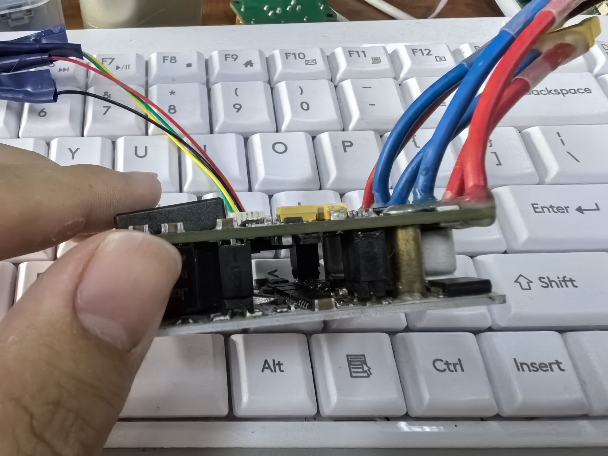
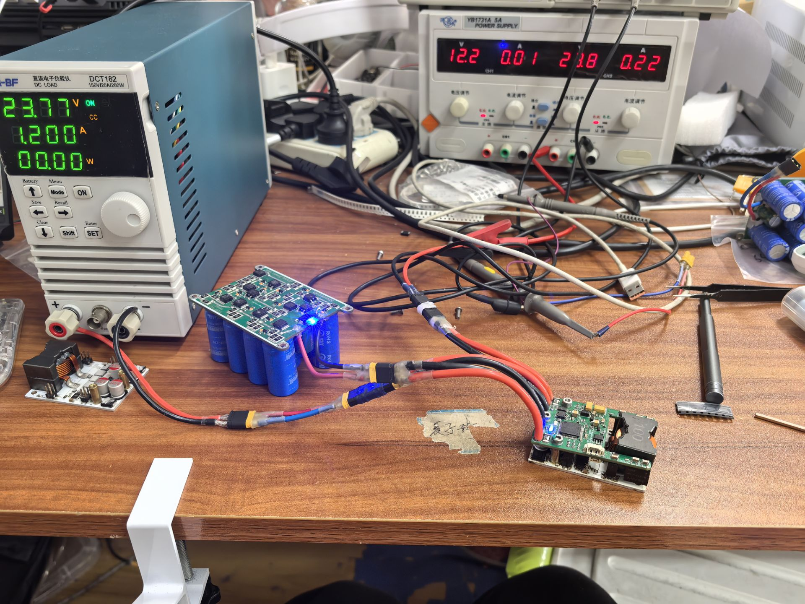

# RM 超级电容控制器

本仓库整合了我的两个 RoboMaster 超级电容控制器项目。

| 项目               | 来源             | 主控      | 目录                                      |
| ------------------ | ---------------- | --------- | ----------------------------------------- |
| RM_SUPERCAP_JSU    | 复刻桂林理工大学 | STM32G431 | [`gui_lin_li_gong/`](./gui_lin_li_gong/)   |
| RM_SUPERCAP_JSU_V2 | 复刻香港科技大学 | STM32F334 | [`xiang_gang_ke_ji/`](./xiang_gang_ke_ji/) |

---

## 一、RM_SUPERCAP_JSU（复刻桂林理工大学）

复刻 RM 桂林理工大学的开源
我们学校一直没有超电，或许我能填补这个空缺

**10.8**
已经做出来了，上车测试功能完好，能充电能放电，暂时没有遇到问题

**10.19**

### 项目简介

SUPERCAP 是专为 RoboMaster 机器人设计的超级电容功率控制器。通过双向 BUCK-BOOST 电路实现超级电容的充放电管理，配合 CAN 总线通信与主控板协同工作，提升机器人瞬时功率输出能力。

### 工作原理

控制器通过 CAN 总线接收 RM 主控板发送的以下指令：

- 系统使能信号
- 充电/放电模式切换
- 底盘功率上限
- 充电功率设定

**充电模式：** 使用 BUCK-BOOST 电路对超级电容充电，通过 PID 算法控制 NMOS 栅极 PWM，精确调节充电电压。

**放电模式：** 使用 BUCK-BOOST 电路向底盘供电，动态调整占空比以控制放电功率，满足功率限制要求。

### 核心器件

| 功能         | 型号            | 规格                  |
| ------------ | --------------- | --------------------- |
| 主控芯片     | STM32G431CBT6   | ARM Cortex-M4, 170MHz |
| 栅极驱动     | EG2181          | 高速半桥驱动器        |
| 半桥 MOS     | WSD40120DN56G   | 40V/120A              |
| 关断 PMOS    | WSD40L60DN56    | 40V/60A               |
| 储能电感     | 106-125 磁环    | 22µH                 |
| 母线电流采样 | INA139          | 高侧电流检测          |
| 电容电流采样 | INA181A2        | 双向电流检测          |
| 辅助电源     | JW5026 + RT9193 | DC-DC + LDO           |

硬件设计工具：**KiCad 8.0**

---

## 二、RM_SUPERCAP_JSU_V2（复刻香港科技大学）

复刻香港科技大学

**[项目技术说明笔记](./xiang_gang_ke_ji/PROJECT_OVERVIEW.md)**

工具链：STM32CubeMX + GCC + JLink_mini + OZONE 调试下载
主要代码用 C++ 编写，然后 `extern "C"` 给出接口

**11.1**
现在的问题是电容端口短路，初步怀疑是原件选型错误，解决方法：加上了群里的同学一起讨论，和队里的研究生一起排查，看研究生的学习笔记，学习 C++

**11.13**
GAME WILL OVER，lucky，终于冲放电成功了，不报错，不过另一个的上板电流采样芯片可能坏了，等快递

**11.15**
研究生学姐走了，剩下的成果归本人所有

**11.18**
第二个也做出来了，一开始错误的原因是底盘电流检测芯片选型错误，要 INA240PW1 才是对的，INA240PW2 的增益是不同的
这如此种种也不过如此啊

**11.19**
炸了....

**11.20**
上车正常，最终效果：可以成功存储能量，要用的时候再输出，根据功率自动选择存储还是释放，功率闭环 + 缓冲能量闭环，限制电池输出功率在 50W 以内，不加超电电池输出在轮子转的时候是 79W 左右，峰值 100+W

> ⚠️ 不要随意 DEBUG：在电容连接上的时候 DEBUG 会使保护程序失灵，可能会炸
> ⚠️ 电池电压低会导致超电无法使用

### 硬件设计要点

- 电流检测：INA240PW1 芯片，测量电阻 2mΩ
- 电压检测：运放 + 分压电阻
- 升降压电路：H 桥方案
- PID：串级功率环（外）+ 电流环/电压环（内）
- 滤波：滤波二极管除尖峰，下板短路时二极管先击穿保护主电路
- 散热：升降压放在铝基板上
- 主控：STM32F334R8（上板），设计 CAN 通信电路、蜂鸣器、LED
- PCB：双层板隔离数字地模拟地，同时节省空间
