# 超电傻瓜式使用教程

> 正常使用的超电不要改代码,下面的步骤是为了新做24超电,新作超电使用(2)
>
> (325)这个是给最早的两个超电,里面拟合好像有些不对,有时会报短路报错(不知道为什么,我猜还是拟合问题),需要车子一直给使能,不过能用,就留着吧
>
> (2)这个是新的超电,里面有修改原版代码,因为第二批买回来的INA芯片采样不准,每次上电的基准值都会发生变化,所以有修改

[(2)修改内容](2)修改内容.md)

## 📥 第一步：下载代码

这个编译学学可以，下载用OZONE
使用 **OZONE + JLink** 进行代码下载。
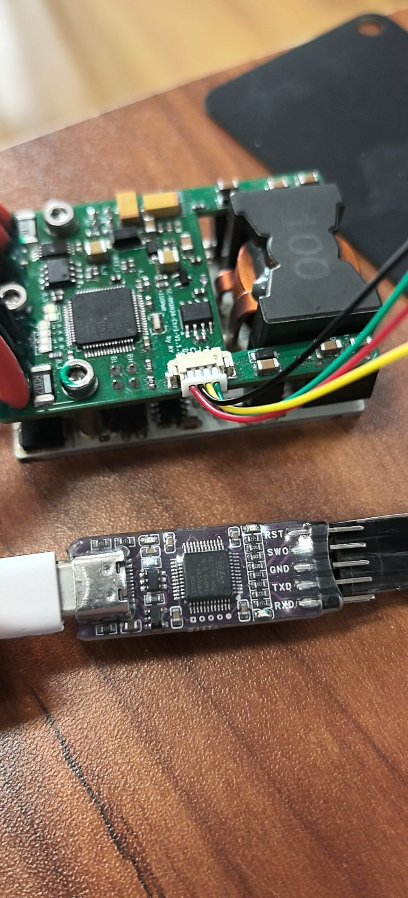

---

## 🔧 第二步：修改硬件ID（新做超电必做）

如果要新做超电，**必须**使用 **STM32CubeProgrammer** 修改硬件ID。

### 操作步骤：

1. 打开 STM32CubeProgrammer
2. 连接设备
3. 将硬件ID修改为 **10x**

> 如果不修改硬件ID，(325)会无法下载,(2)蜂鸣器会一直响

> **操作示例：**
> 请参考示例图片进行操作
> 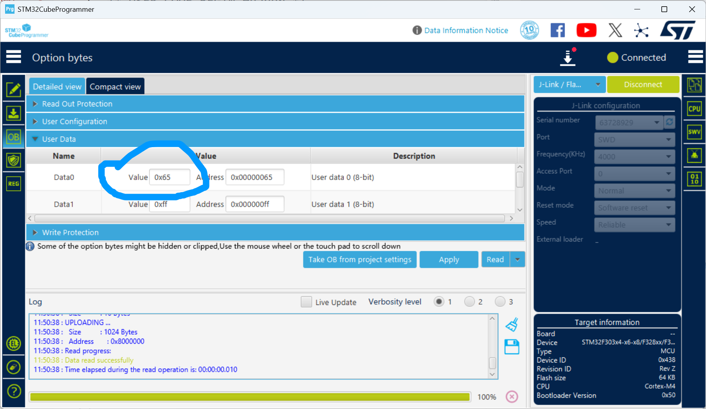

---

## 第三步:编译

1. **ARM GCC 工具链** - `arm-none-eabi-gcc`
2. **CMake** - 版本 3.22 或更高
3. **Ninja** - 构建工具
4. **Git Bash** - Windows 环境下需要

### 📝 在 Git Bash 中编译

#### 1. 打开 Git Bash

在项目目录中右键，选择 "Git Bash Here"

#### 2. 给脚本添加执行权限（首次运行）

```bash
chmod +x build.sh
```

#### 3. 运行编译脚本

```bash
# 指定 HARDWARE_ID
./build.sh 101
```

## 第四步：测试

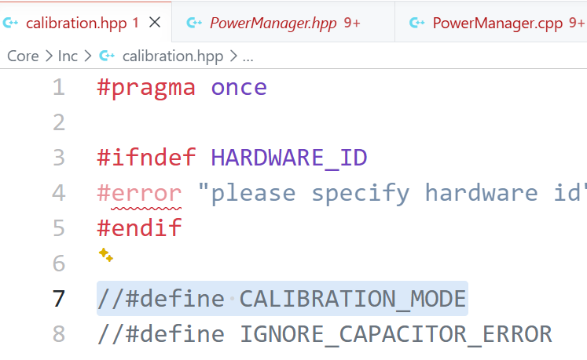

这里取消注释

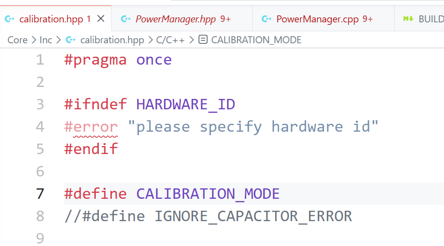

然后编译,(2)会把上管打开,下管关闭

先开电源,然后下载进去,运行

此时应该是电源电压和负载仪的电压电流差不多,此时读出来的I就是要用来拟合的

---

## 拟合

拟合数据记录,然后丢给AI,让他帮你改Core\Inc\calibration.hpp这里的数值

这是IA端拟合示例

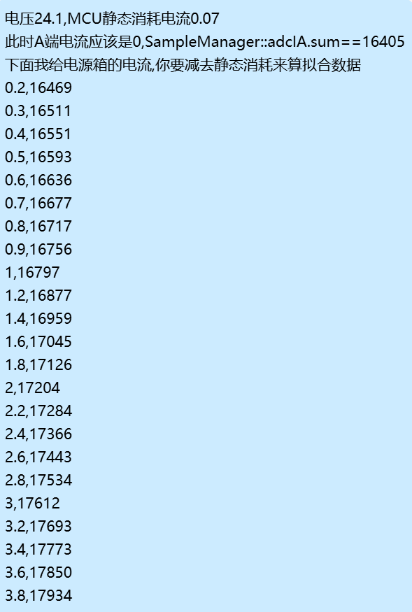

VA拟合示例

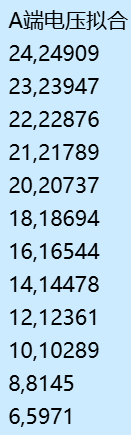

B端拟合示例

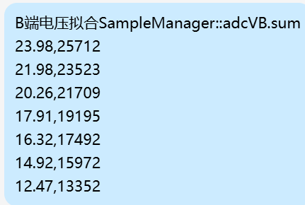

IB拟合


ireference拟合示例

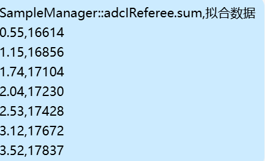

拟合好就改回去//#define CALIBRATION_MODE

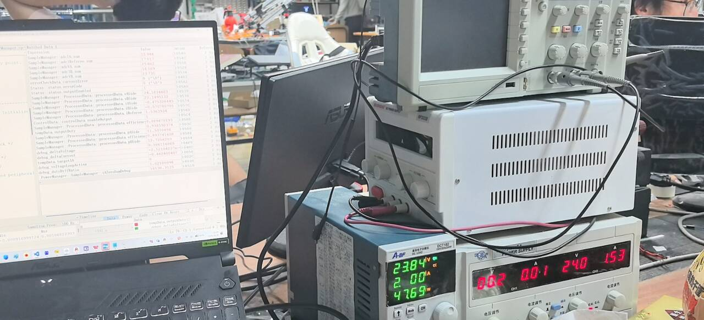

---

## 🔌 接线说明

### 端口连接示意（从正面看）

```
┌─────────────────────────────────┐
│  左侧        中间        右侧    │
│ 电源(电管)  底盘(中心板)  电容   │
│  电流流入    电流流出    储能端  │
└─────────────────────────────────┘
```

- **右边**：接电容
- **中间**：接底盘（中心板）—— 电流流出
- **左边**：接电源（电管）

> **接线示例：**
> 请参考示例图片进行操作
> 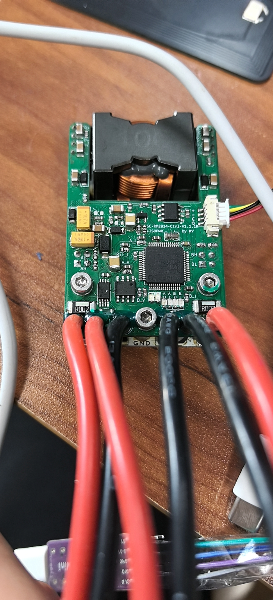

---

## 🏁 超电裁判系统接法

> **接线示例：**
> 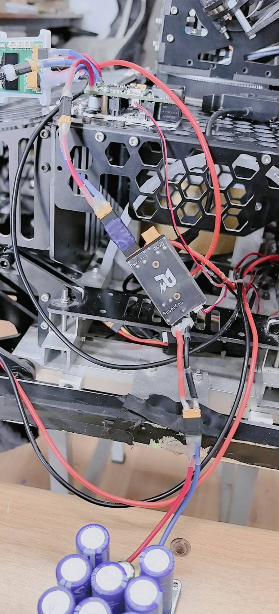


---

## 📡 第五步：CAN通信配置

xiang_gang_ke_ji\super_cap_extract_20260428
这里放的是车上的超电相关代码配置,我让AI读了英雄车上的代码,没怎么看
里面应该有个程序,好像是几秒就使能一下超电,这是因为最老的两个超电容易短路保护,这很奇怪,所以就一直使能就好了

---

## ✅ 完成

按照以上步骤操作，超电即可正常使用！1级580W的最大可使用功率!

---

*文档最后更新：2026/4/28*
